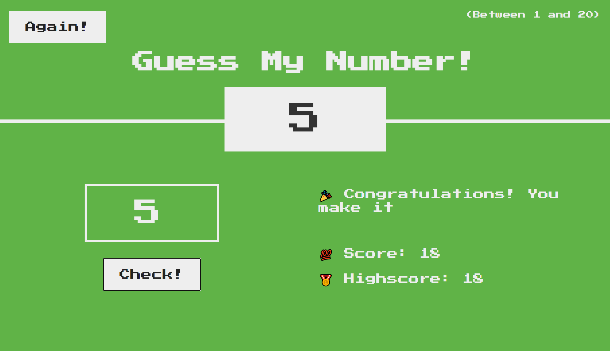

# Guess-My-Number

A side-project that I created with the instructor of the course "The Complete JavaScript Course 2021: From Zero to Expert" on Udemy. It's a game project of guessing numbers, that a random number will be generated within the range of 1 to 20 at the start, then player can start guessing the number. 
There're 20 points for the game in all, meaning that player will lose one point each time if the wrong number is taken, also based off of the value that is greater or less, the hint will be given correspondingly. The project is implemented by using HTML5, CSS3M, Vanilla JavaScript, and DOM.

