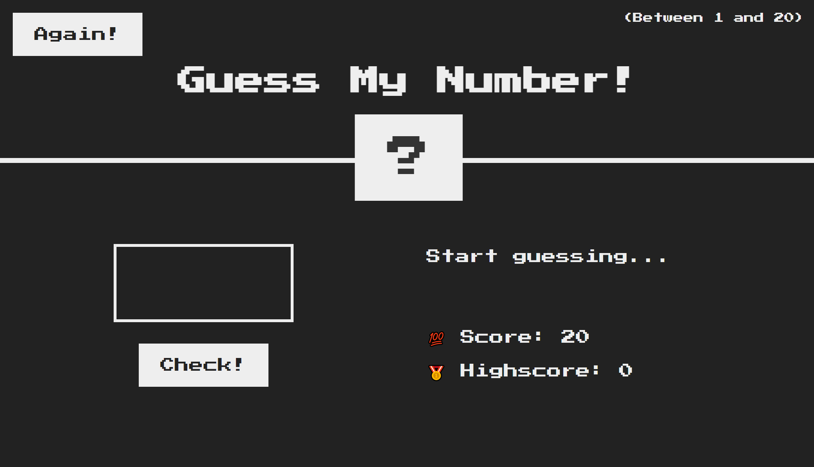

# Guess-My-Number

A side-project that I created with the instructions of Jonas Schmedtmann, the lecturer of the course "The Complete JavaScript Course 2021: From Zero to Expert" on Udemy. It's a game project related to guessing numbers, that a random number will be automatically generated with the range of 1 to 20 when the game starts. There're 20 points for the game in all, meaning that the player will lose one point each time if the wrong number is chosen, and the game will be over when player loses all. Also, based off of the value that is greater or less, the hint will be given correspondingly. The project is implemented by **JavaScript** and **DOM API**, HTML5 and CSS3 templates are given by **Jonas Schmedtmann**.

